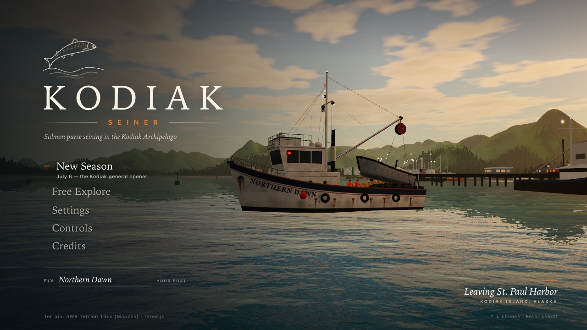
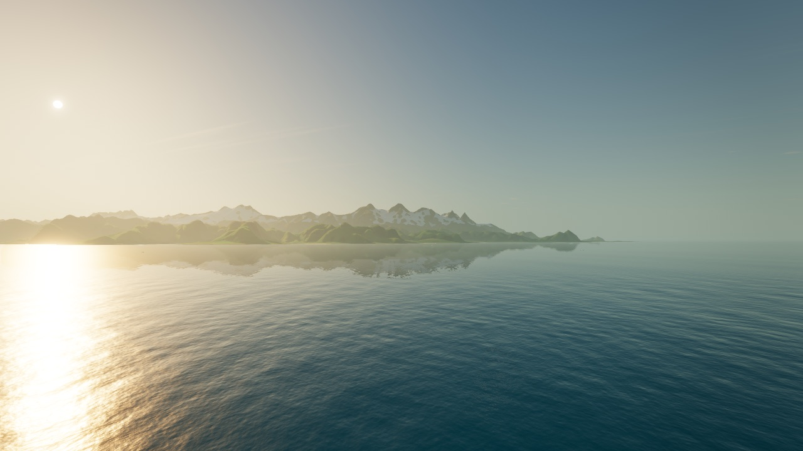
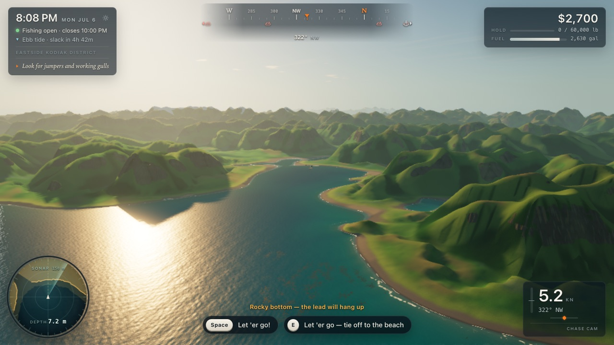
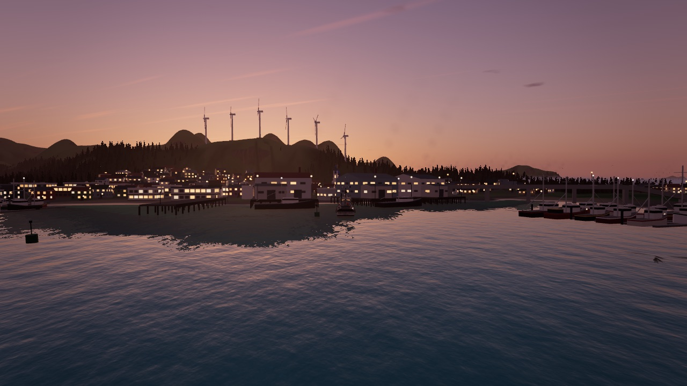
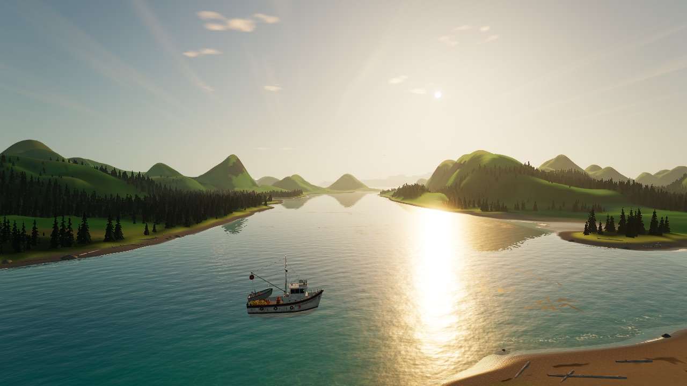
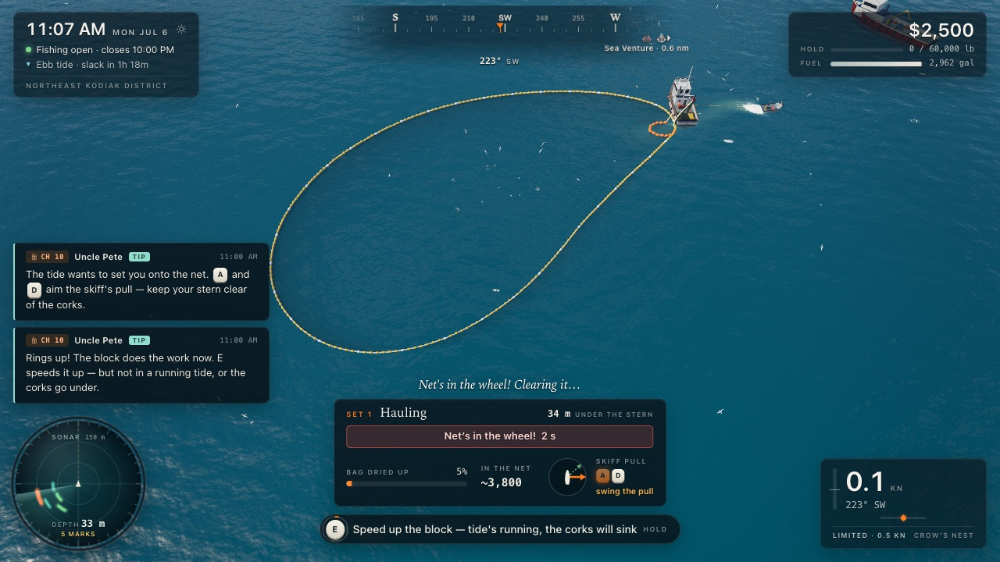
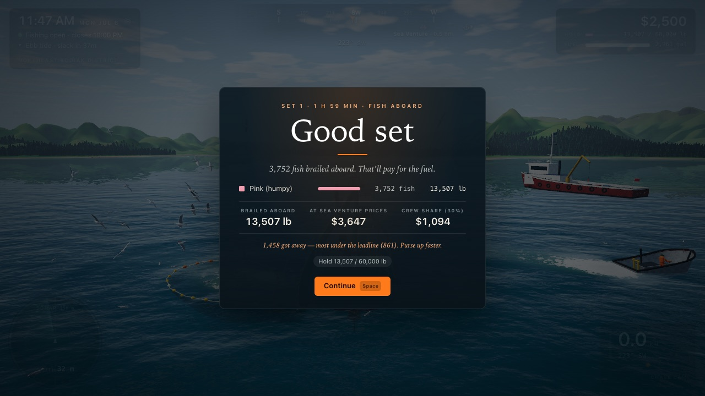
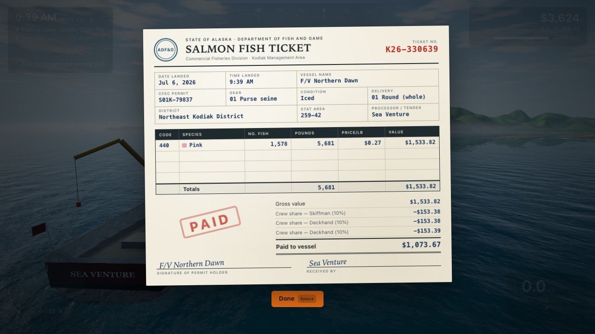
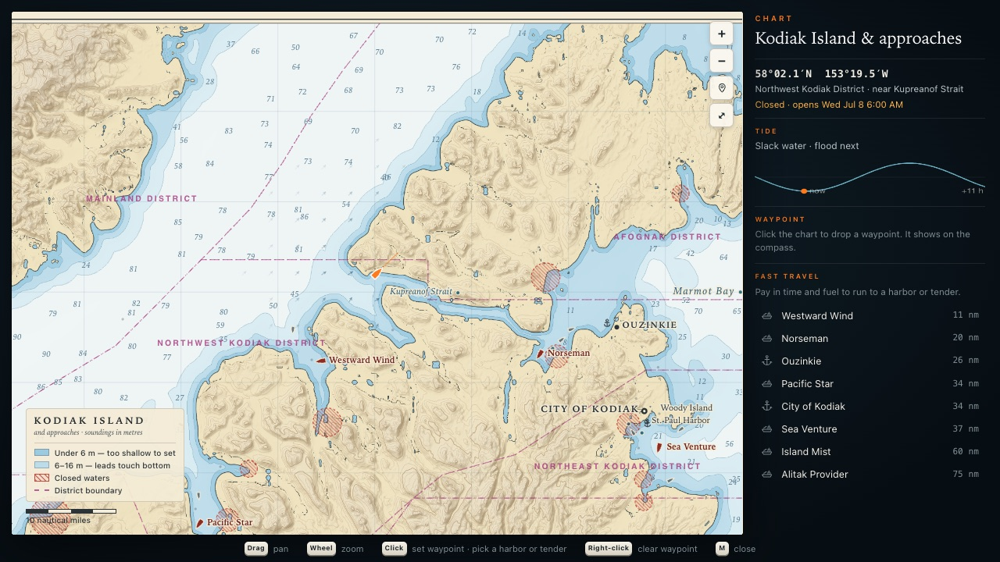

# Kodiak Seiner

**Play it in your browser: https://steveoscar.github.io/kodiak-seiner/**

A 3D game about Alaskan salmon purse seining on a real-geography Kodiak Island. Skipper a 58-foot limit seiner
through a July pink-salmon season: read the jumpers, let the skiff go, lay the seine around the school (or hook it
off a point), close up, purse, haul with the power block, brail the catch into the hold and deliver it to a tender
for a fish ticket. Between fishing periods, explore the bays, villages, canneries, capes and mountains by boat and
on foot.



| | |
|---|---|
|  |  |
|  |  |
|  |  |
|  |  |

## What's in it

- **The real archipelago.** Terrain and bathymetry come from a public elevation model of Kodiak, Afognak and the
  Alaska Peninsula volcanoes across Shelikof Strait, compressed ~1:12 horizontally. Kupreanof Strait and Whale
  Passage, which that compression closes, are re-opened along their charted lines so every district is reachable.
- **Purse seining, the way Kodiak does it.** Round hauls and hook sets tied off to the beach, a skiff that tows you
  off the net while you purse, tension on the purse winch, corks going under in a running tide, leads on a rocky
  bottom, "net in the wheel", plugged sets and water hauls. Pinks, chums, sockeye and coho with their own jump
  styles and run timing; kings are released as the regulations require.
- **A season.** ADF&G fishing periods from July 6, tenders on the grounds, ex-vessel prices that vary by tender, a
  30% crew share on every fish ticket, fuel, upgrades (seine length and depth, power block, sonar, RSW, engine),
  a fleet board of rival boats, closed waters and the occasional trooper.
- **Exploration.** 80 named places with short, true histories (including Alutiiq names and the 1964 tsunami),
  wildlife from humpbacks and orcas to brown bears fishing the Karluk, and hikes to summits on foot.
- **Free Explore** with instant teleport anywhere on the island (**T**, the pause menu, or click the chart).
- **Weather and light.** Real sun and moon positions for 57.6°N, long July twilight, marine fog, rain, storms and
  late-season aurora.

Everything you see and hear is generated at runtime: geometry, shaders, textures, the chart and the Web Audio
soundscape. There are no downloaded art or sound assets.

## Controls

| Key | Action |
|---|---|
| W / S | Throttle (tap for a notch, hold to slide) |
| A / D | Rudder; while pursing and hauling, aim the skiff's pull |
| Mouse drag, wheel | Orbit and zoom the camera |
| C | Camera: chase, crow's nest (best for setting), bridge |
| B or hold right mouse | Binoculars |
| Space | Let the skiff go, hold the hook, close up, skip the brail; jump on foot |
| E | Context action: purse, haul, deliver, tie up, go ashore, sleep |
| M | Chart (waypoints, fast travel) |
| L | Logbook |
| T | Teleport (Free Explore) |
| G / N | Horn / deck lights |
| H | Photo mode |
| Esc | Pause and settings |
| F1 | Help |

A gamepad works too. Tested in Chrome on Apple Silicon Macs; the game lowers its resolution automatically if
frames run long, and Settings has quality presets.

## Development

```
npm install
npm run dev        # play at the printed URL
npm test           # unit tests (node:test)
npm run build      # production build in dist/
node tools/smoke.mjs --scenario=basic --strict   # headless real-GPU play test with screenshots
```

- [SPEC.md](SPEC.md) is the design and interface contract between the game's systems; `notes/` has each system's
  build notes.
- `tools/fetch-dem.mjs` regenerates the heightmap (including the carved channels); `tools/connectivity.mjs` checks
  that the waters are navigable from Kodiak.
- Pushing to `main` deploys to GitHub Pages via `.github/workflows/deploy.yml`.

## Credits

Built with [three.js](https://threejs.org) and [Vite](https://vitejs.dev). Elevation data: see
[THIRD_PARTY_NOTICES.md](THIRD_PARTY_NOTICES.md). Resampled for a game; not for navigation.
